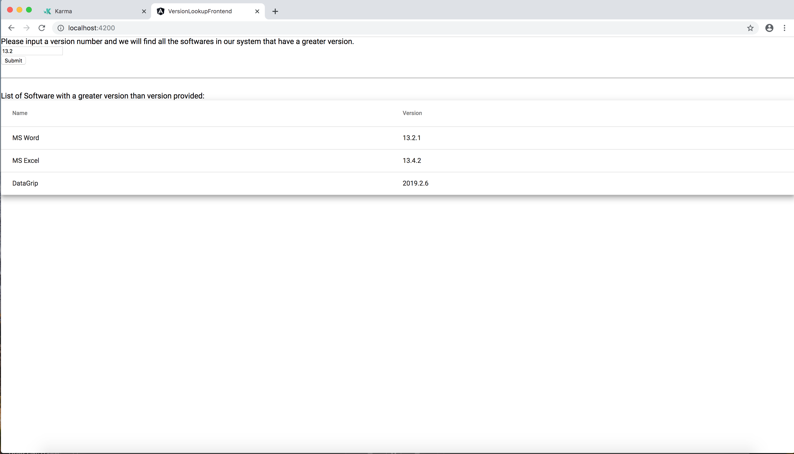

# SoftwareVersionLookup
This is a project I did as a coding challenge. The goal of this application is
to give users a way to lookup software that has a larger version then the one
provided by the user. The list of software to choose from is provided as a
file that the backend loads from the file system.

# Running the Application
The application was written with an Angular frontend and a Flask/Python Backend.
In order to run the application you must run both.

## Backend
The backend was written using a virtualenv. To start the application activate
the virtaulenv and then run flask. Here is an example of starting the backend:

~~~~
cd backend
. env/bin/activate
cd VersionLookupApi
flask run
~~~~

When you are finished you can use ctrl-c to stop the server and run `deactivate`
to exit the virtualenv. When running the application it is important to know
that flask run will only work when you are in the /backend/VersionLookupApi
directory.

If you want to run the test-suite run `pytest` in the /backend/VersionLookupApi
directory.

## Frontend
The frontend was built using the angular cli which in turn uses npm. if you
don't have npm [follow these steps](https://docs.npmjs.com/downloading-and-installing-node-js-and-npm).
Once you have npm you can install the cli globally using
`npm install -g @angular/cli`. To start the frontend run `ng serve` in the
/frontend/VersionLookupFrontend directory and go to http://localhost:4200/.

if you want to run the tests use `ng test`

# Future work
If I had more time there are a couple of things that I would have continued to
work on. First, I would extract URLs and file locations into configurations
files. I would also have built an automated end to end test and created better
documentation. For additional features I would have liked to build the ability
on the backend to save the list of softwares in a database instead of a file.
I would have also liked to give more descriptive feedback to the user when they
enter an invalid software version.  Lastly I would have improved the look of the
frontend so that it looks more modern.
